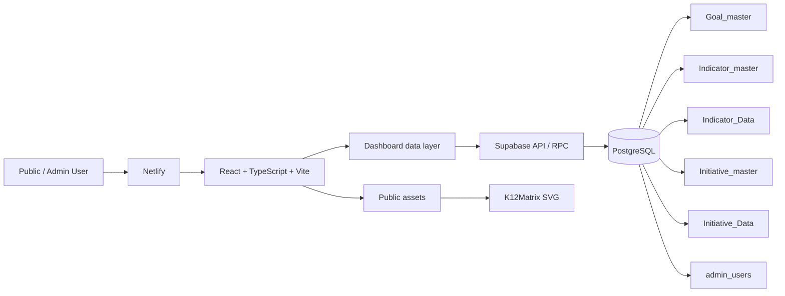

# Strategic Plan Dashboard — AI Context Info

> **Purpose:** canonical AI/agent handoff document. Read this file before making enhancements, bug fixes, schema changes, UX changes, releases, or deployment recommendations. It is designed to let a new AI tool understand the product without relying on prior chat history.

## 1. Product identity

**Product name:** Strategic Plan Dashboard.

Do not call the product “District 360.” Some historical identifiers and earlier documentation may contain that name; those are legacy technical/history references, not the current product name.

The product is a K-12 school-district strategic-plan dashboard. It turns district strategic-plan Goals, Initiatives, Action Items and Indicators into an executive/public-facing visual experience, with an administrative experience planned/partially implemented for managing the underlying information.

The product’s key differentiator is the UX. The supplied/frozen UX must be treated as a visual specification, not inspiration.

## 2. Repository and environments

Repository: `sselvavenkatesh/Strategicplandashboard`

Important branches:
- `main` — repository default/history.
- `react-dashboard` — established React production integration branch.
- `release/v1.0` — immutable V1.0 baseline.
- `release/v2.0-dev` — V2.0 development/production lineage used for the latest changes.
- `release/v2.0-frozen-checkpoint-1` — frozen V2 checkpoint.
- `qa/v2.0-responsive` — experimental responsive QA branch; product owner explicitly said not to continue work there.

Frozen UX commit: `c75815e76e79b8fa97599d924265d7bd8015d0f7`.

Frozen UX:
- `ux-preview/index.html`
- `ux-preview/styles.css`
- `ux-preview/app.js`
- `ux-preview/assets/k12matrix-logo.svg`

React production URL:
`https://vocal-twilight-54ee43.netlify.app/#/`

Frozen UX preview:
`https://sselvavenkatesh.github.io/Strategicplandashboard/`

## 3. Product-owner operating rules

1. Never modify `ux-preview/` unless the product owner explicitly reopens UX design.
2. React must reproduce the approved UX using real Supabase data; do not copy screenshot placeholder values.
3. Do not invent database columns, formulas, business rules, benchmark rules, or role behavior.
4. Before changing schema, inspect the live schema/migrations.
5. Use preview branches/deployments for iteration.
6. QA failures must be investigated and corrected, not merely reported.
7. A successful compile/build is not equivalent to UX approval.
8. Do not merge/release without explicit product-owner approval.
9. Preserve frozen/release checkpoints.
10. Keep explanations concise and nontechnical when communicating with the product owner.
11. Current product name is **Strategic Plan Dashboard**.
12. Never commit Supabase passwords, service-role keys or other secrets.

## 4. User experience architecture

Primary user flow:

```text
Welcome
  ↓
Goal Summary
  ↓
Goal Specific
  ├─ Initiative card → Initiative Detail popup
  └─ Indicator card → NO popup in current V2.0
```

The historical frozen UX includes an Indicator Detail popup, but the latest explicit V2.0 requirement disabled Indicator-card click/keyboard activation. Do not re-enable it unless requested.

### Global shell

Header:
- district mark/logo;
- district name (prototype currently Riverside School District from data/context);
- subtle **Powered By K12Matrix** branding;
- Sign In pill;
- hamburger menu.

Hamburger opens a right-side navigation panel:
- Explore the Dashboard
- Help / Filters controls
- Home
- Summary
- visible Goals
- Powered By K12Matrix branding.

Current React shell does not use the earlier fixed global footer; K12Matrix branding was moved into the header. This supersedes the older frozen-footer requirement for current V2.

Route changes show a K12Matrix loader.

### Welcome

Purpose: introduce the district Strategic Plan and provide a visual entry point.

Content:
- Strategic Plan duration;
- district name;
- Strategic Plan Dashboard title;
- supporting/sub text;
- Goal cards;
- Mission Statement;
- Vision Statement;
- CTA **Explore Strategic Plan →**.

Clicking a Goal on Welcome goes to Summary.

### Goal Summary

Purpose: show all Goals in one executive overview.

Each Goal card includes:
- Goal image;
- Goal number/name/description;
- aggregate Initiative status distribution;
- Key Indicator cards.

Heading uses the actual Strategic Plan Name and Duration from District Profile.

Indicator cards use short names. Fund Balance is formatted as `$x.xxM`. LY variance uses KPI Nature.

Clicking a Goal card opens that Goal’s Goal Specific page.

### Goal Specific

Purpose: detailed Goal performance.

Top:
- Goal tabs;
- Goal number/name/description.

Key Initiatives:
- desktop target: four compact cards per row;
- Initiative short name and description;
- Start/End duration;
- overall completion percentage;
- completion gauge;
- Sub-Initiative 100% stacked bars.

Completion comes from Action Item status, not a manually entered percentage.

Gauge tooltip/focus detail includes Initiative name, Sub-Initiatives, Start Date, End Date, Total Action Items and Completed %.

Key Indicators:
- Indicator short name and description;
- latest KPI value;
- LY variance;
- Statewide Average;
- School Year trend bars.

**Current behavior:** Indicator cards are display-only at Goal level. Click/keyboard activation does not open Indicator Detail.

### Initiative Detail popup

Opens from an Initiative card and preserves the Goal page underneath.

Contains:
- Goal/Initiative context;
- Plan of Action timeline;
- overall Done %;
- gauge;
- enlarged Sub-Initiative progress visualization.

### Indicator Detail popup

Historical/frozen UX capability and React implementation exists, but current V2.0 card activation is disabled. If re-enabled in a future version, expected content includes latest KPI, year selector, history and Student Group performance with Statewide Average reference.

### Sign In

Custom database-backed Admin Sign In, not Supabase Auth.

Popup:
- canonical K12Matrix logo;
- ADMIN ACCESS;
- Sign In;
- text: **“Sign in with your administrator account.”**
- email/password;
- submit.

RPC: `validate_admin_login(p_email,p_password)`.
Passwords are validated using pgcrypto-backed hashes.
Browser session key currently uses legacy identifier `district360_admin`; do not rename without a deliberate migration.
Google/Microsoft SSO is future scope.

## 5. Visual system

- Dark-first dashboard.
- Light theme was an original requirement/foundation; verify current implementation before extending.
- Compact, information-dense cards.
- Blue accent, dark navy surfaces, muted supporting text.
- UX should fit common laptop viewports with minimal unnecessary vertical whitespace.
- Secondary detail should use progressive disclosure/tooltips where appropriate.
- Keyboard/touch equivalents are required for meaningful interactions.
- Responsive design is required.

Representative QA targets:
- 1920×1080
- 1366×768
- 768×1024
- 390×844
- 360×800

Canonical K12Matrix asset:
- source: `ux-preview/assets/k12matrix-logo.svg` — frozen, do not edit;
- React-served copy: `public/k12matrix-logo.svg`;
- React URL: `/k12matrix-logo.svg`.

## 6. Technical architecture



Frontend:
- React 19
- TypeScript
- Vite
- React Router
- Lucide React
- Recharts dependency available
- CSS responsive/frozen-UX parity layers

Backend:
- Supabase
- PostgreSQL
- SQL views/functions/RPC
- RLS enabled on current public tables; policy hardening must remain part of security review
- Supabase environment variables; secrets must never be committed.

Hosting:
- Netlify for React production/deploy previews.
- GitHub Pages for frozen UX prototype.

## 7. Data model

Core tables:
- `District_Profile`
- `Goal_master`
- `Indicator_master`
- `Indicator_Data`
- `Initiative_master`
- `Initiative_Data`
- `admin_users`

### District_Profile

Fields used by React include:
- District ID
- School District Name
- Strategic Plan Name
- Strategic Plan Duration
- Sub Text
- Total Goals
- Mission Statement
- Vision Statement
- District Logo
- Strategic Plan Image

### Goal_master

Known business fields include:
- Goal ID (PK)
- Goal Name
- Goal Description
- Total Indicators
- Total Initiatives
- optional Stakeholder ID

### Indicator_master

Known business fields include:
- Indicator ID (PK)
- Indicator Name
- Indicator_short_name
- Indicator Type
- Goal ID (FK)
- KPI Nature
- optional Stakeholder ID

Known KPI Nature rule:
- Positive: increase is favorable.
- Negative: decrease is favorable.

Current short names:
- ID1 M-Step ELA
- ID2 M-Step Math
- ID3 SAT
- ID4 Freshmen on Track
- ID5 Graduation Rate
- ID6 Fund Balance
- ID7 Chronic Absenteeism

Nature:
- ID1–ID6 Positive
- ID7 Negative

### Indicator_Data

Known fields:
- Goal ID
- Goal Name
- Indicator ID
- Indicator Name
- School Year
- Category
- Student Group
- Value 1
- Value 2
- Value 3
- School (nullable)

Composite key historically defined around Indicator ID, Indicator Name, School Year, Category and Student Group. Inspect live schema before relying on exact current constraints.

District-level KPI:
latest School Year where Category = All and Student Group = All Students; use Value 3.

Statewide Average:
Category = Statewide Average, Student Group = All Students; use Value 3.

For district-level Indicator reporting, current reporting functions use `School IS NULL`. A selected School scopes applicable rows while Statewide Average remains statewide.

### Initiative_master

Known fields include:
- Initiative ID
- Initiative Name
- Initiative_Short_name
- Goal ID
- optional Stakeholder ID

Current short names:
- IN1 Strengthen Core Instruction
- IN2 Strengthen PLC Practice
- IN3 Build Achievement & Belonging
- IN4 Expand MTSS Supports
- IN5 Strengthen Core Instruction
- IN6 Build Achievement & Belonging
- IN7 Expand Equitable Access
- IN8 Build Safe & Welcoming Schools
- IN9 Strengthen Induction & Mentorship
- IN10 Build Career Pathway Partnerships
- IN11 Improve Equitable Hiring

### Initiative_Data

Known fields:
- Goal ID
- Goal Name
- Initiative ID
- Initiative Name
- Sub Initiative Name
- Start Date
- End Date
- Action Item
- Status
- Target 1
- Target 2
- Target 3
- School (nullable)
- optional Stakeholder ID
- Role where applicable

Status semantics:
- Done
- In Progress
- Not Yet Started

Completion = Done Action Items / all Action Items at the requested reporting grain.

### admin_users

Used for current administrator access and optional stakeholder ownership. Known concepts include email, name, password hash and Role (All/Admin). Do not expose password/hash fields to public clients.

Stakeholder assignment is optional. Business tables should store Stakeholder ID, not duplicate stakeholder names.

## 8. Reporting layer

Implemented reporting objects documented in project requirements:
- `vw_indicator_reporting_normalized`
- `fn_goal_initiative_progress(goal, school)`
- `fn_initiative_progress(goal, school)`
- `fn_subinitiative_progress(goal, initiative, school)`
- `fn_indicator_key_values(goal, school)`
- `fn_indicator_year_history(indicator, school)`
- `fn_indicator_student_groups(indicator, school_year, school)`

Security model: reporting functions are SECURITY INVOKER and therefore do not bypass caller permissions/RLS.

Initiative reporting:
- null School = all applicable Initiative rows;
- selected School = same formulas scoped to School.

Indicator reporting:
- null School = district-level rows where School IS NULL;
- selected School = selected School rows;
- Statewide Average remains statewide reference.

## 9. Formatting/business rules

- Fund Balance: `$x.xxM`.
- Percentage values: retain %.
- LY variance: current minus prior year; display one decimal where applicable.
- Favorability uses KPI Nature.
- Never hide master Indicators solely because data is missing.
- Missing data uses an unavailable state.
- Do not fabricate KPI values.
- Initiative completion is derived from Action Items.
- Keep counts as well as percentages where tooltips/details need both.

## 10. Security

Before expanding Admin functionality:
- verify RLS policies for every public table/view/function;
- ensure public aggregates cannot expose Role=Admin rows;
- do not expose service-role credentials in frontend;
- protect Admin-only mutations;
- review foreign-key indexes;
- keep stakeholder ownership optional;
- do not put plaintext passwords in tables or source code.

Public dashboard may be shared read-only with stakeholders if these protections remain intact.

## 11. Deployment/release workflow

Preferred workflow:

```text
Requirement
→ implementation branch
→ build/tests
→ Netlify Deploy Preview
→ data/interaction/visual/responsive QA
→ product-owner review
→ corrections
→ explicit approval
→ frozen release checkpoint
→ production publish
```

Do not claim Netlify success unless verified. The product owner can manually promote a successful Deploy Preview using Netlify **Publish deploy**.

Avoid unnecessary production publishes because Netlify production deploys consume credits.

## 12. Known release history

- V1.0 Welcome and Goal Summary established/frozen.
- Goal Initiative charts approved/frozen.
- V2.0 added/refined:
  - Welcome CTA wording;
  - Strategic Plan name/duration on Summary;
  - K12Matrix route loader;
  - Summary Indicator short names;
  - Fund Balance millions formatting;
  - Riverside/district header refinement;
  - canonical K12Matrix logo in header/nav/loader;
  - K12Matrix logo in Sign In;
  - revised Sign In copy;
  - Goal Indicator detail popup activation disabled.
- V2.0 was manually published to Netlify.
- V2.1 planning begins only after documentation/context/BRD preparation.

## 13. Known superseded decisions

Do not blindly follow old text if it conflicts with these:
- Product name “District 360” → superseded by **Strategic Plan Dashboard**.
- Fixed global K12Matrix footer → current React branding is in header/nav; footer removed.
- Goal Indicator click opens detail → disabled in current V2.0.
- Sign In copy mentioning District 360 → replaced by “Sign in with your administrator account.”
- `qa/v2.0-responsive` as active work branch → explicitly discontinued.

## 14. Where an AI agent should look next

Before coding:
1. Read this file.
2. Read `docs/USER_REQUIREMENTS_AND_PROMPTS.md`.
3. Read `docs/MASTER_PRODUCT_SPEC.md` if present.
4. Inspect the current target branch and current React source.
5. Inspect `ux-preview/` for visual truth where not superseded.
6. Inspect current Supabase schema/migrations before database work.
7. Confirm which release/preview branch the product owner wants changed.
8. For UX changes, compare the actual rendered candidate at desktop and mobile sizes before calling it complete.

If code and documentation disagree, do not guess. Prefer the latest explicit product-owner requirement and ask for clarification when the conflict materially changes behavior.


---

## V2.1 freeze checkpoint — 26 Sep 2026

V2.1 public dashboard is product-owner approved and frozen.

Treat the V2.1 branch/checkpoint as immutable after the freeze. It contains the final approved public dashboard, including dark/light themes, scalable Goal handling, Key Resources, Initiative/Indicator popup refinements, Indicator selected-year behavior, navigation refinements, and final KPI/LY variance alignment.

For subsequent work:
- create/use **v2.2** from the frozen V2.1 head;
- V2.2 scope begins with the **Admin page**;
- do not alter the V2.1 frozen checkpoint to implement Admin functionality;
- preserve existing public-dashboard behavior while Admin work proceeds;
- follow build/test → Deploy Preview → QA → product-owner approval before any production promotion.
