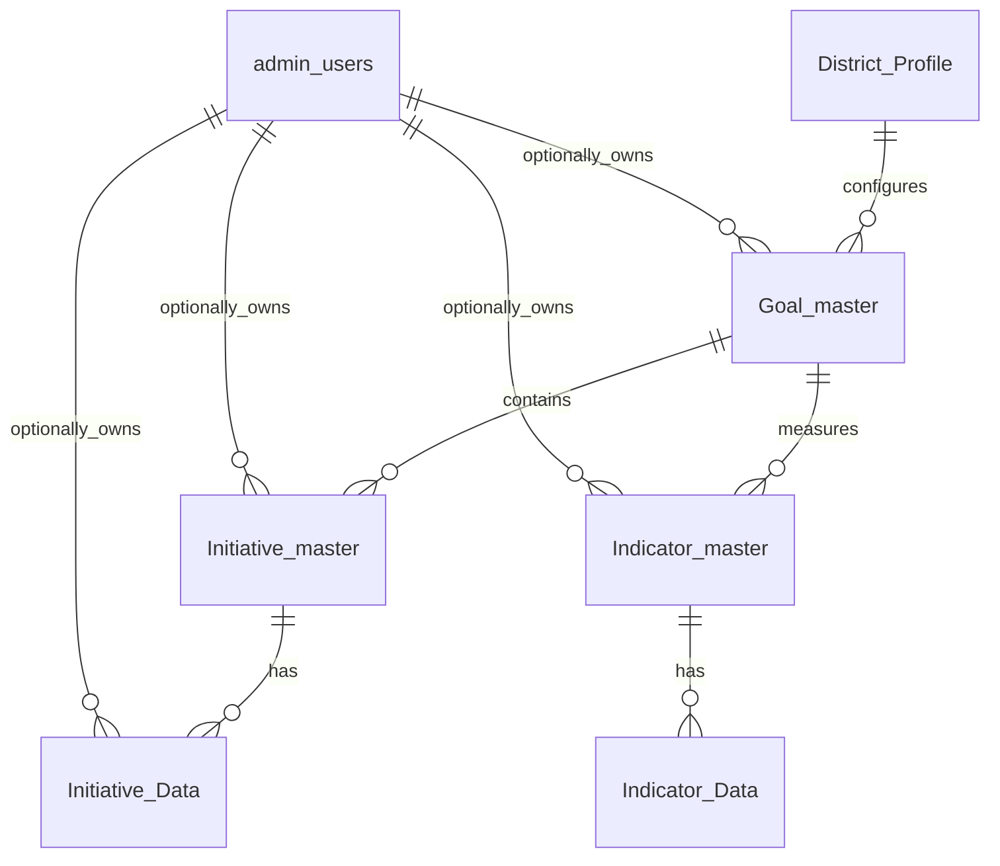
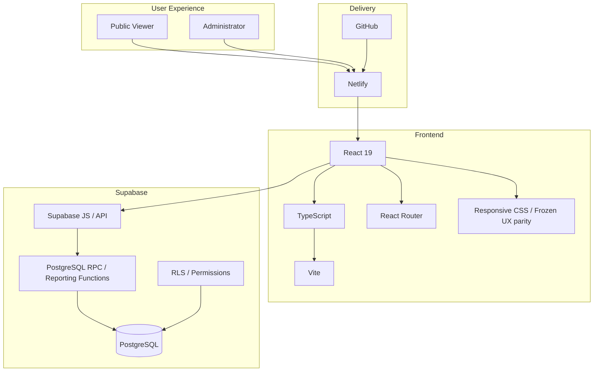

# Strategic Plan Dashboard — Business Requirements Document (BRD)

**Document status:** V2.1 frozen public-dashboard baseline / V2.2 Admin planning input  
**Product:** Strategic Plan Dashboard  
**Audience:** Product owner, school-district stakeholders, UX/design, engineering, QA, AI development agents

## 1. Executive summary

Strategic Plan Dashboard is a K-12 school-district product for communicating and monitoring execution of a district Strategic Plan. It connects high-level Goals to Initiatives, Sub-Initiatives, Action Items and measurable Indicators so district leaders and stakeholders can understand both **what the district intends to achieve** and **how implementation/performance is progressing**.

The public-facing experience is designed as a concise executive dashboard. Administrative capabilities support or will support controlled management of district profile information, Goals, Initiatives, Indicators and associated data.

The product is intentionally data-driven: master records define what should appear, reporting data supplies measurable values, and missing data is represented explicitly rather than replaced with sample values.

## 2. Business objectives

- Give district stakeholders a 360-degree view of Strategic Plan execution.
- Present Goals, Initiative progress and measurable outcomes in a single coherent experience.
- Make complex plan information understandable without requiring users to interpret raw spreadsheets.
- Provide transparent progress reporting using Action Item status and KPI history.
- Support district-level reporting today and a path to school-level/multi-district reporting.
- Keep public consumption simple while protecting administrative functions.
- Preserve a distinctive, professional K-12 UX across desktop and mobile.

## 3. Primary users

**Public / stakeholder viewer:** board members, families, staff, community members and other stakeholders who need read-only insight into Strategic Plan priorities and progress.

**District administrator:** authorized district personnel who sign in to manage or review administrative information. The current Sign In mechanism is custom database-backed authentication; broader Admin/Data Management capability remains an enhancement area.

**Future assigned stakeholder/owner:** an administrator optionally assigned to a Goal, Initiative, Indicator or applicable action-level record. Ownership is optional.

## 4. Functional scope

### 4.1 Global navigation and branding

The application provides a persistent header with district identity, K12Matrix branding, Sign In and a hamburger menu. The hamburger opens a right-side navigation panel containing Home, Summary and visible Goals, with compact Help/Filter controls.

Page navigation displays a K12Matrix loading treatment. The canonical K12Matrix logo is reused consistently.

### 4.2 Welcome page

**Purpose:** establish the district Strategic Plan context and provide the primary entry point.

**Business content:**
- Strategic Plan duration;
- district name;
- Strategic Plan Dashboard heading;
- strategic-plan supporting text;
- Goal cards;
- Mission Statement;
- Vision Statement;
- **Explore Strategic Plan →** CTA.

**Behavior:** selecting a Goal card or CTA moves the user into the Summary experience.

**Screenshot / visual reference:** the production implementation should be captured from the current production site for release documentation. The frozen visual specification is available in `../ux-preview/`.  
Production route: `https://vocal-twilight-54ee43.netlify.app/#/`

> **Screenshot note:** no repository screenshot image currently exists for this page. Do not fabricate one. Add an approved production capture under `docs/screenshots/welcome.png` when a browser-capture asset is available.

### 4.3 Goal Summary page

**Purpose:** provide an executive overview of every Strategic Plan Goal.

Each Goal card contains:
- Goal image;
- Goal number/name/description;
- Key Initiative aggregate status;
- Key Indicator cards;
- latest KPI values and LY variance where available.

The page heading displays the actual Strategic Plan Name and Duration from District Profile.

**Behavior:** selecting a Goal opens the corresponding Goal Specific page.

**Business rules:**
- all master Indicators should remain represented even when data is unavailable;
- missing data uses an unavailable state;
- Fund Balance displays as `$x.xxM`;
- Indicator short names are used;
- LY variance favorability uses KPI Nature.

Production route: `https://vocal-twilight-54ee43.netlify.app/#/summary`

> **Screenshot note:** add an approved production capture as `docs/screenshots/summary.png` when available. The frozen UX in `../ux-preview/` is the current visual source of truth for comparison.

### 4.4 Goal Specific page

**Purpose:** provide detailed implementation and outcome information for a selected Goal.

Header area:
- Goal tabs;
- Goal number;
- Goal name;
- Goal description.

#### Key Initiatives

Each Initiative tile includes:
- Initiative short name;
- Initiative description/name;
- duration;
- overall Done %;
- progress gauge;
- Sub-Initiative status bars.

Desktop target is four compact Initiative cards per row.

#### Key Indicators

Each Indicator tile includes:
- Indicator short name;
- Indicator description/name;
- latest KPI value;
- LY variance;
- Statewide Average;
- historical School Year bars.

**Current V2.0 behavior:** Indicator cards are display-only. Clicking/keyboard-activating a Goal Indicator does **not** open Indicator Detail.

Production route pattern: `https://vocal-twilight-54ee43.netlify.app/#/goals/{GoalID}`

> **Screenshot note:** add an approved production capture as `docs/screenshots/goal.png` when available.

### 4.5 Initiative Detail popup

**Purpose:** provide deeper Initiative context without leaving the selected Goal.

Content:
- Goal/Initiative context;
- Plan of Action timeline;
- overall completion;
- gauge;
- enlarged Sub-Initiative progress visualization.

The underlying Goal page remains visible behind the modal.

> **Screenshot note:** add an approved production capture as `docs/screenshots/initiative-detail.png` when available.

### 4.6 Indicator Detail popup — historical/future-capable

The frozen UX and React code include an Indicator Detail popup concept with:
- current KPI;
- selected School Year;
- KPI history;
- Student Group performance;
- Statewide Average reference.

However, **current V2.0 explicitly disables opening this popup from Goal Indicator cards**. This section documents the capability/history and must not be interpreted as an instruction to re-enable it.

> **Screenshot note:** use the frozen UX for historical visual reference if needed; do not represent this as a current V2.0 user interaction.

### 4.7 Sign In popup

**Purpose:** provide administrator access.

Current UI:
- K12Matrix logo;
- ADMIN ACCESS;
- Sign In;
- “Sign in with your administrator account.”
- Email;
- Password;
- Sign In action.

Authentication currently calls `validate_admin_login(p_email,p_password)`. It is not Supabase Auth.

> **Current screenshot evidence:** the product-owner review screenshot from 26 Sep 2026 showed the production header/Sign In treatment during the K12Matrix branding correction. The binary image is not stored in this repository; an approved capture should be added to `docs/screenshots/sign-in.png` when available.

## 5. Business rules

### 5.1 Initiative progress

Action Items are the unit of Initiative completion.

```text
Done % = Done Action Items / Total Action Items × 100
In Progress % = In Progress Action Items / Total Action Items × 100
Not Yet Started % = Not Yet Started Action Items / Total Action Items × 100
```

The same logic is applied at Goal, Initiative and Sub-Initiative reporting grains.

Status values:
- Done
- In Progress
- Not Yet Started

Overall Initiative completion equals its Done percentage.

### 5.2 Indicator values

Key KPI value:
- most recent School Year;
- Category = All;
- Student Group = All Students;
- Value 3.

Statewide Average:
- Category = Statewide Average;
- Student Group = All Students;
- Value 3.

Historical charts use chronological School Year ordering.

### 5.3 LY variance

LY variance compares the latest value with the prior-year value.

Favorability:
- Positive KPI Nature: increase is favorable.
- Negative KPI Nature: decrease is favorable.

### 5.4 Formatting

- percentage KPIs retain `%`;
- Fund Balance is formatted in millions as `$x.xxM`;
- numeric presentation is kept compact and consistent;
- no fake/sample KPI value may replace missing production data.

### 5.5 School scope

Initiatives:
- All Schools → all applicable Initiative rows;
- selected School → same calculations filtered to School.

Indicators:
- district level → `School IS NULL`;
- selected School → selected School rows;
- Statewide Average remains statewide.

### 5.6 Role/security scope

Public-facing content must not expose Admin-only records. Historical model includes Role values such as All/Admin. RLS and reporting functions must enforce access appropriately.

## 6. Data model

### 6.1 High-level relationship



### 6.2 Table summary

| Table | Purpose | Important known fields |
|---|---|---|
| `District_Profile` | District/plan branding and narrative | District ID, School District Name, Strategic Plan Name, Strategic Plan Duration, Sub Text, Total Goals, Mission Statement, Vision Statement, District Logo, Strategic Plan Image |
| `Goal_master` | Goal definitions | Goal ID, Goal Name, Goal Description, Total Indicators, Total Initiatives, optional Stakeholder ID |
| `Initiative_master` | Initiative definitions | Initiative ID, Initiative Name, Initiative_Short_name, Goal ID, optional Stakeholder ID |
| `Initiative_Data` | Action-level execution data | Goal ID/Name, Initiative ID/Name, Sub Initiative Name, Start Date, End Date, Action Item, Status, Target 1/2/3, School, Stakeholder ID, Role where applicable |
| `Indicator_master` | KPI definitions | Indicator ID, Indicator Name, Indicator_short_name, Indicator Type, Goal ID, KPI Nature, optional Stakeholder ID |
| `Indicator_Data` | KPI observations | Goal ID/Name, Indicator ID/Name, School Year, Category, Student Group, Value 1/2/3, School |
| `admin_users` | Admin identity / optional ownership | id, email, Name, password/hash fields, Role |

The live database schema is authoritative. Before migrations, inspect current Supabase schema and constraints rather than relying only on this BRD.

### 6.3 Reporting layer

Current reporting objects:
- `vw_indicator_reporting_normalized`
- `fn_goal_initiative_progress(goal, school)`
- `fn_initiative_progress(goal, school)`
- `fn_subinitiative_progress(goal, initiative, school)`
- `fn_indicator_key_values(goal, school)`
- `fn_indicator_year_history(indicator, school)`
- `fn_indicator_student_groups(indicator, school_year, school)`
- `validate_admin_login(p_email,p_password)`

Reporting functions are intended to centralize reusable business logic rather than duplicating calculations in every frontend chart.

## 7. Technical architecture

### 7.1 Tech stack visualization



### 7.2 Frontend

- React 19
- TypeScript
- Vite
- React Router
- Lucide React
- Recharts dependency
- responsive CSS
- environment-driven Supabase configuration

### 7.3 Backend

- Supabase
- PostgreSQL
- SQL views/functions/RPC
- RLS
- pgcrypto-backed current Admin password validation

### 7.4 Hosting/source control

- GitHub: source control and frozen UX.
- GitHub Pages: frozen UX preview.
- Netlify: React Deploy Previews and production hosting.

## 8. Non-functional requirements

### UX fidelity
Frozen UX is the visual source of truth unless explicitly superseded.

### Responsiveness
Support desktop, laptop, tablet and mobile. Representative QA sizes:
- 1920×1080
- 1366×768
- 768×1024
- 390×844
- 360×800

### Accessibility
- meaningful controls must support keyboard/touch;
- modals should support Escape/close behavior;
- interactive cards need visible cues;
- important information must not depend exclusively on hover.

### Performance
Keep dashboard cards compact, avoid unnecessary heavy assets, and minimize redundant database requests where practical.

### Security
- never expose service-role keys;
- enforce RLS/access;
- public users are read-only;
- protect Admin mutations;
- do not expose password hashes;
- ensure Admin-only records do not leak into public aggregates.

### Maintainability
Centralize reusable reporting logic and avoid one-off calculations/views for each chart when a common reporting grain can serve multiple pages.

## 9. Release and QA requirements

```text
Requirements
→ branch
→ implementation
→ build/tests
→ Deploy Preview
→ data QA
→ interaction QA
→ UX parity QA
→ responsive QA
→ product-owner approval
→ freeze
→ production publish
```

A build/deployment alone is not approval.

For every release:
- verify master records render;
- verify missing-data states;
- verify Initiative status math;
- verify KPI value/variance/nature;
- verify Fund Balance formatting;
- verify Statewide Average;
- verify navigation;
- verify modal behavior that is currently enabled;
- verify responsive layouts;
- compare against frozen UX;
- verify Netlify status before claiming success.

## 10. Current V2.0 baseline

Current production includes:
- Welcome;
- Goal Summary;
- Goal Specific;
- Initiative Detail popup;
- right navigation;
- Admin Sign In popup;
- K12Matrix loader/branding;
- real Supabase data integration;
- Indicator cards with click-to-detail disabled;
- revised Sign In K12Matrix logo/copy.

V2.0 has been manually promoted to Netlify production.

## 11. V2.1 planning boundary

No V2.1 feature should be assumed from this BRD. The product owner will define V2.1 scope. V2.1 work should begin from the approved production baseline, use a dedicated development/preview branch, and follow the established QA/approval workflow.

## 12. Screenshot completion record

The BRD intentionally does **not fabricate screenshots**. At the time this document was generated, the repository contained the frozen UX implementation but no approved binary screenshot set for each current production page, and the available GitHub connector supports UTF-8 repository files rather than browser screenshot capture/upload.

Required future screenshot assets:
- `docs/screenshots/welcome.png`
- `docs/screenshots/summary.png`
- `docs/screenshots/goal.png`
- `docs/screenshots/initiative-detail.png`
- `docs/screenshots/sign-in.png`

Once approved captures are added, replace the notes above with Markdown image references. The functional BRD, schemas and architecture visualization are complete independently of those binary captures.


---

## 13. V2.1 frozen public-dashboard baseline — 26 Sep 2026

V2.1 is approved and frozen as the current public-dashboard functional/UX baseline. Where this section conflicts with historical V2.0 statements above, this section is authoritative.

V2.1 includes approved dark and light themes; Welcome, Summary and Goal experiences; dynamic/scalable Goal presentation; Initiative and Indicator tiles; Initiative Detail and Indicator Detail popups; right-side navigation; Key Resources external navigation; K12Matrix branding; and Supabase-backed reporting.

Important V2.1 behavior:
- Indicator Detail is enabled and opens from Indicator tiles.
- Initiative and Indicator popup titles show short name followed by long name.
- Goal tabs horizontally scroll when required and Welcome supports additional Goal rows while preserving four cards per desktop row.
- Goal identity supports eight distinct icons consistently across Welcome, Goal/popups and navigation.
- Navigation Help and Filter controls are hidden.
- Goal page includes a Key Resources button that opens the configured strategic-plan resource folder.
- Indicator LY variance is positioned beside/below the KPI value with LY Var inline and protected from overlap with Statewide Average.
- Initiative timeline uses Sub-Initiative End Dates, completion-driven flag status, collision handling, and a single final milestone labeled Initiative End.
- Theme preference is persisted; dark remains default.

The frozen V2.1 branch/checkpoint must remain unchanged after freeze. V2.2 is reserved for Admin-page development and should start from the frozen V2.1 code/documentation state.
