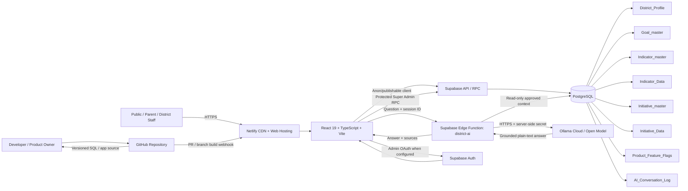

# Strategic Plan Dashboard - Technical Architecture

Architecture version: V2.3 development
Baseline: V2.2 frozen product remains immutable.

## 1. Architecture principles

The product uses a thin React presentation layer, Supabase as the managed application/data platform, PostgreSQL reporting functions for reusable business logic, and Netlify for web delivery. V2.3 adds K12 AI Assistant behind a database feature flag. AI is read-only and grounded in approved district data.

Principles:
- preserve frozen release branches;
- public dashboard is read-only;
- centralize business calculations in reporting SQL/RPCs;
- secrets never enter React or GitHub;
- AI cannot modify district data;
- AI refuses questions outside district/strategic-plan scope;
- feature availability is controlled independently of code deployment.

## 2. System context

User -> Netlify -> React/TypeScript/Vite -> Supabase API/RPC -> PostgreSQL.

K12 AI path:
User -> React -> Supabase district-ai Edge Function -> approved PostgreSQL data -> Ollama Cloud -> Edge Function -> React.

GitHub is source control. Netlify creates Deploy Previews and hosts the React application. Supabase provides PostgreSQL, API/RPC, authentication capabilities and Edge Functions.


## Architecture visual

The diagram below is the canonical connection workflow for V2.3.



### Connection workflow

| Connection | Protocol / contract | Security boundary | Purpose |
| --- | --- | --- | --- |
| Browser -> Netlify | HTTPS | Public edge | Deliver the compiled React application and static assets. |
| React -> Supabase | HTTPS via Supabase client | Publishable/anon browser credential + RLS/RPC | Read dashboard data, call approved RPCs, Auth and Edge Functions. |
| Supabase -> PostgreSQL | Managed internal service | RLS, SQL permissions, protected functions | Store district configuration, goals, indicators, initiatives, sessions, flags and logs. |
| React -> district-ai | HTTPS Edge Function invocation | JWT verification + server function boundary | Submit K12 AI questions without exposing provider credentials. |
| district-ai -> PostgreSQL | Supabase service context | Backend only | Retrieve approved district context and write AI audit events. |
| district-ai -> Ollama Cloud | HTTPS | OLLAMA_API_KEY stored only as Supabase secret | Generate a grounded, plain-language response from supplied district context. |
| GitHub -> Netlify | Repository integration | Branch/PR controls | Build Deploy Previews and production candidates from versioned source. |

## 3. Frontend architecture

Technology: React 19, TypeScript, Vite, React Router, Lucide React and responsive CSS with dark/light themes.

Primary routes:
- / Welcome
- /summary strategic-plan summary
- /goals/:goalId goal detail
- /ai K12 AI Assistant
- /superadmin Super Admin

AppShell owns district branding, Admin sign-in, theme control, feature-gated K12 AI entry and navigation. Dashboard pages use src/lib/dashboard.ts. AI calls are isolated in src/lib/ai.ts.

V2.3 AI UI is intentionally lightweight: compact AI icon, conversational answers, Copy/Download, progress indicator and a left-side Popular Questions pane with ten strategic-plan prompts. AI chart generation is excluded from the lightweight design.

## 4. Data architecture

Core PostgreSQL tables:
- District_Profile: district identity, plan metadata, mission/vision, branding and sign-in configuration.
- Goal_master: strategic goals.
- Indicator_master: indicator definitions, type and KPI nature.
- Indicator_Data: observations by year/category/student group/school.
- Initiative_master: initiative definitions.
- Initiative_Data: sub-initiatives/action items/status/targets.
- admin_users: Admin/SuperAdmin account metadata.
- Product_Feature_Flags: version/feature enablement.
- AI_Conversation_Log: AI audit records.
- superadmin_sessions: server-validated Super Admin sessions.

Relationships follow Goal -> Indicator/Initiative -> reporting data. School and Role provide applicable reporting/access dimensions.

## 5. Reporting and business logic

Reusable reporting objects include vw_indicator_reporting_normalized, fn_goal_initiative_progress, fn_initiative_progress, fn_subinitiative_progress, fn_indicator_key_values, fn_indicator_year_history and fn_indicator_student_groups.

Initiative completion is derived from Action Item status. Indicator reporting separates district/school observations from Statewide Average reference rows. KPI favorability uses KPI Nature. Fund Balance has dedicated display formatting.

## 6. Authentication and authorization

Public dashboard access is read-only.

Admin supports configured Userbased login and Google/Microsoft SSO flows. Userbased validation uses protected database RPC logic. SSO authorization is validated against active Admin records.

Super Admin uses dedicated validation/session RPCs and a server-issued token. Configuration writes and Goal deletion are performed by protected RPCs that validate the token.

RLS is enabled on relevant tables. Service-role credentials are backend-only. Browser code must never contain service-role keys, Ollama keys, password hashes or OAuth secrets.

## 7. K12 AI Assistant architecture

Request flow:
1. User submits a question or selects a Popular Question.
2. React sends question plus session ID to district-ai.
3. Edge Function performs scope/safety validation.
4. Edge Function retrieves approved district data read-only.
5. Grounded context and question are sent to Ollama Cloud.
6. Ollama returns a plain-language answer.
7. Edge Function records the audit event.
8. React renders answer, data sources, Copy and Download.

Feature gate: Product_Feature_Flags stores V2.3 / AI Assistant / Y or N. React calls is_feature_enabled. The AI icon is shown only when enabled.

Current development provider is Ollama Cloud. Provider/model settings are server-side and the API key is a Supabase secret. The provider can be replaced later without redesigning the React contract.

Grounding rules:
- approved strategic-plan data is authoritative;
- outside knowledge and invented district facts are prohibited;
- unsupported evidence is identified as insufficient;
- out-of-scope/offensive questions are rejected;
- AI has no write path to strategic-plan business tables.

Response rules:
- parent/general-public-first plain English;
- descriptive but focused;
- Markdown decoration such as double-asterisk bold markers, horizontal-rule filler and heading hashes is removed;
- Copy gives visual confirmation;
- Download creates a text answer;
- loader communicates that district data is being reviewed;
- no AI chart generation in the lightweight V2.3 design.

AI_Conversation_Log records session, question, response, scope decision, data-source metadata, response time and optional feedback fields.

## 8. Super Admin architecture

Super Admin is isolated at /superadmin. It manages district/plan configuration, goals and sign-in configuration. Goal deletion performs dependency validation before removal. Configuration writes use protected backend RPCs rather than direct untrusted browser writes.

Indicator/Initiative configuration remains an area for future controlled CRUD expansion; validation, ID generation, dependency checks and atomic writes should be completed before unrestricted editing.

## 9. Feature management

Product_Feature_Flags allows a deployed capability to be enabled or disabled without altering V2.2. V2.3 K12 AI is the first feature using this mechanism.

Future flags should follow Version Name + Feature Name + Enabled unless a later migration deliberately introduces district-specific entitlements.

## 10. Deployment architecture

Source control: GitHub.
Development branch: v2.3, created from immutable v2.2-frozen.
Production integration: react-dashboard.
Web hosting: Netlify.
Database/backend: Supabase.
AI provider during V2.3 development: Ollama Cloud.

Release workflow:
Requirement -> v2.3 implementation -> build -> Netlify Deploy Preview -> functional/data/security/UX QA -> product-owner approval -> frozen V2.3 checkpoint -> merge -> production verification.

V2.2 and v2.2-frozen must not be changed by V2.3 work.

## 11. Security boundaries

1. Browser is untrusted.
2. Supabase RLS/RPC/Edge Function boundary enforces server-side rules.
3. Database service credentials remain server-side.
4. Ollama API key remains a Supabase secret.
5. AI output is generated content, not authorization.
6. AI cannot execute database mutations.
7. Super Admin mutations require validated server session/token.

Before multi-client rollout add AI rate limiting, per-user/district quotas, monitoring, provider timeout/retry controls, prompt-injection testing and district-level tenant isolation.

## 12. Performance and scalability

Dashboard reporting favors reusable SQL functions and bounded result sets. AI responses are intentionally text-first and lightweight. Future optimization should retrieve only question-relevant rows rather than broad table slices to reduce latency and model usage.

For client scale, introduce district/tenant IDs throughout authorization, AI retrieval and logging; enforce tenant isolation in RLS; add observability and AI usage quotas; and optionally move to a stronger hosted/private model without changing the React contract.

## 13. Failure handling

- Feature-flag failure defaults AI to hidden.
- AI service failure returns a friendly unavailable message.
- Out-of-scope requests do not execute normal AI answering.
- Missing district evidence produces an insufficient-data response.
- Netlify build success is not release approval.
- Database/API errors must not expose credentials or raw secrets.

## 14. Current V2.3 boundaries

Included: K12 AI Assistant, feature flag, Ollama Cloud integration, scope/safety controls, audit log, popular questions, plain-language answers, Copy/Download and loading feedback.

Not included: AI database writes, public-internet answers, autonomous actions, model fine-tuning, chart generation, unrestricted text-to-SQL, or production multi-tenant AI billing.


## 16. Component ownership and change boundaries

| Component | Primary responsibility | Change discipline |
| --- | --- | --- |
| React AppShell | Global branding, navigation, theme, Admin entry, AI feature entry | Preserve inherited V2.2 behavior unless explicitly superseded. |
| Dashboard pages / dashboard.ts | Public strategic-plan presentation and reporting calls | Data-driven; no hard-coded KPI facts. |
| Supabase PostgreSQL | Authoritative district configuration and reporting data | Schema changes through reviewed migrations. |
| Reporting views/functions | Reusable KPI and initiative calculations | Keep business formulas centralized and consistent. |
| Supabase Auth/RPC | Authentication and protected server operations | Secrets and privileged logic remain server-side. |
| Supabase Edge Functions | AI orchestration and server-side integrations | Never expose service/provider credentials to the browser. |
| Ollama Cloud | V2.3 development inference provider | Replaceable provider; not a system of record. |
| Netlify | Web build, Deploy Preview and hosting | Preview before production; build success is not product approval. |
| GitHub | Source/version/release history | Frozen branches remain immutable. |

## 17. Data-flow detail

### Public dashboard request
1. Netlify serves the compiled React application.
2. React loads district profile and visible Goal/reporting data through Supabase.
3. Supabase applies the caller's permissions/RLS and executes reporting SQL/RPCs.
4. React formats and renders the approved dashboard experience.

### K12 AI request
1. The AI feature flag is read from Supabase. A disabled flag hides the entry point.
2. The user types a district question or selects a Popular Question.
3. React invokes district-ai with the question and a session identifier.
4. district-ai rejects unsupported/offensive/out-of-scope input before normal answering.
5. The function retrieves approved district context from PostgreSQL.
6. The function sends only that grounded context and the question to Ollama Cloud.
7. Ollama returns text; the server applies lightweight formatting cleanup.
8. The response and source metadata return to React.
9. The interaction is written to AI_Conversation_Log.
10. React presents the answer with Copy/Download. No AI chart-generation path is used.

### Super Admin request
1. Super Admin signs in through the dedicated validation flow.
2. The backend issues/validates a temporary Super Admin session token.
3. Protected configuration RPCs validate the token before writes.
4. Goal deletion checks dependencies before allowing removal.
5. Browser code never receives service-role or AI-provider secrets.

## 18. Deployment topology

```text
Developer workstation
        |
        v
GitHub: v2.3 branch / Draft PR
        |
        +----> Netlify Deploy Preview ----> QA / product-owner review
        |
        +----> Supabase project
                |-- PostgreSQL + RLS + RPC
                |-- Auth
                |-- Edge Functions
                |-- Secrets
                         |
                         +----> Ollama Cloud

After explicit release approval:
v2.3 frozen checkpoint -> production integration branch -> Netlify production verification
```

## 19. Production hardening roadmap

For a multi-client school-district rollout, extend the current architecture with tenant/district isolation across every business table and AI request, per-district feature entitlements, AI rate limits and quotas, centralized telemetry, timeout/retry/circuit-breaker controls, provider/model configuration, prompt-injection and adversarial testing, retention policies for AI logs, and formal backup/disaster-recovery procedures. The existing React-to-Edge-Function contract should remain stable so the model provider can be upgraded without redesigning the user experience.


Update this document whenever architecture, security boundaries, hosting, data contracts, authentication or AI-provider design changes.


## 15. V2.3 release architecture checkpoint — 27 Sep 2026

This architecture is frozen with V2.3. V2.2 remains the immutable non-AI baseline; V2.3 layers K12 AI Assistant and its supporting feature flag, Edge Function, audit data and UX on top of that baseline. The AI path is read-only and text-only in this release. No AI chart-generation path is part of the frozen architecture.

Production promotion must merge the frozen V2.3 source into the production integration branch without modifying either frozen V2.2 branch.
